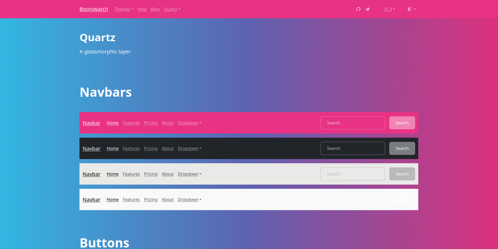

# nextjs-bootstrap-static-pages

NextJS Template configured for pure client-side application (AKA export mode), GitHub Pages deployment, and React-Bootstrap/Bootstrap 5.3 styling.

## 🚀 Use this template

### Via GitHub (recommended)

Press the "Use This Template" button and create your own repository.

### Via npx

Invoke `create-next-app`:

```
npx create-next-app@latest -e https://github.com/Shaumik-Ashraf/nextjs-bootstrap-static-pages
```

Setup a new GitHub repository (required for GitHub Pages):

```
git init
git add --all
git commit -m "init commit"
git remote add origin [new-repository-url]
git push --force -u origin main
```

## 📚 Dependencies

- [NodeJS](https://nodejs.org) v22.11.0 (may work with other versions)
- npm v11.10.0 or greater

**This app is configured to not install any packages released in the last 30 days for
supply chain security. If you have different needs, edit `.npmrc`.**

## 💻 Developer Start

1. Open your command line and run `npm install`

2. Run `npm run dev` to start the development server

3. Open <http://localhost:3000> to view the live app

## ⚙️ Deployment

### GitHub Pages

1. Go to your repository **Settings -> Pages** and set **Source** to `GitHub Actions`.

2. Allow a few minutes to replicate, and the site will become available.

You can get more guidance at [GitHub's documentation](https://docs.github.com/en/pages).

### Generic Instructions

1. First, compile this app into static HTML, CSS, and JavaScript:

```
npm run build
```

The final output will be in the `out/` folder. The build process is powered by NextJS'
[export mode](https://nextjs.org/docs/pages/guides/static-exports).

2. Serve the contents in `out/` with a production-grade file server such as
[NGINX](https://nginx.org) or [Apache](https://apache.org/).

3. Acquire a domain, configure the DNS, and setup SSL certification. Consult your
hosting service or web server documentation for how do this.

This app also comes with an `npm start` command which will run a web server for you,
however you **should not** use it for production since it cannot handle
SSL, rate limiting, or other critical features.

## 📒 Documentation

- [NextJS 16](https://nextjs.org) **This app uses Pages mode**
- [React-Bootstrap](https://react-bootstrap.github.io/)
- [Bootstrap 5](https://getbootstrap.com/)
- [ReactJS 19](https://react.dev/)
- [Playwright](https://playwright.dev/)

### Themes

This template comes with bootstrap themes you can easily swap. The default theme is
[Brite](https://bootswatch.com/brite/) and you can change themes by loading
its corresponding bootstrap CSS file in `styles/globals.css`. For example to use the
solar theme:

```css
// styles/globals.css
@import "../themes/solar/bootstrap.min.css";
```

Themes are provided by [bootswatch](https://bootswatch.com/). Any theme should work.

You can also add [Sass support](https://nextjs.org/docs/app/guides/sass) to NextJS
and [customize bootstrap](https://getbootstrap.com/docs/5.3/customize/sass) directly.

#### Brite


#### Cerulean


#### Journal


#### Quartz



#### Vanilla

This is the default Bootstrap theme.


### Testing

This template comes with Playwright for end-to-end testing. Here is a quick command reference:

|:          command             |:                     purpose                    |
|-------------------------------|-------------------------------------------------|
| `npm test`                    |  Run e2e tests                                  |
| `npx playwright install-deps` |  Install browser binaries                       |
| `npx playwright show-report`  |  Show last test run HTML report                 |
| `npx playwright test --ui`    |  Launch interactive testing GUI                 |
| `npx playwright codegen`      |  Record a browser session to generate test code |

### Agentic Development

Agentic development (with `claude code`, `opencode`, etc.) is very new and constantly changing
"best practices." Nonetheless here are a few recommendations:

1. Upon first opening your agent, run the `/init` skill to create a common AGENTS.md (or CLAUDE.md, etc.)
file to save time and tokens on code exploration. If you have opinions and experience, I recommend you
manually review it and add your own tips or guardrails. `/init` must also be re-run regularly to stay updated
on your codebase's state.

2. For each task, enter `/plan` mode first and give it feedback meticulously. You should use the `/grill-me`
[skill](https://www.skills.sh/docs) here. After approving and implementing the plan, review the `git diff`
(or put up a draft pull request) and review the code again. With the surplus of AI generated code and slop,
code review and quality assurance is more important than ever.

3. *If you encounter bugs:* give the agent visual browser access with the `/playwright-cli` skill. Writing
high-impact integration tests and doing [test driven development](https://en.wikipedia.org/wiki/Test-driven_development)
(`/tdd`) improves the chance and quality of agent success.

