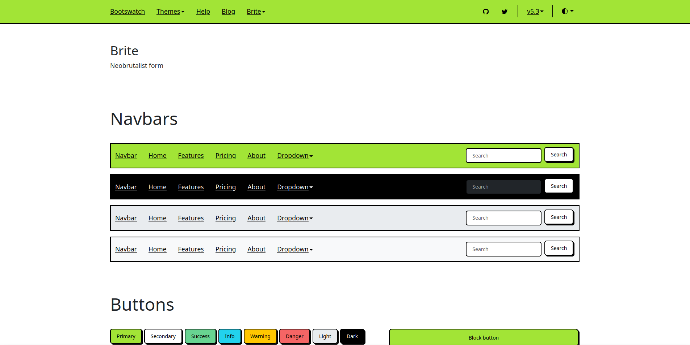
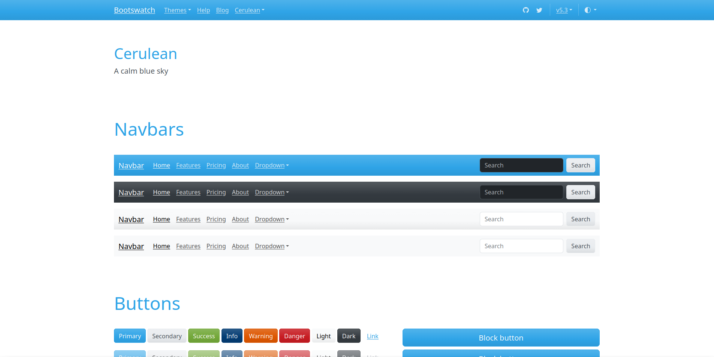
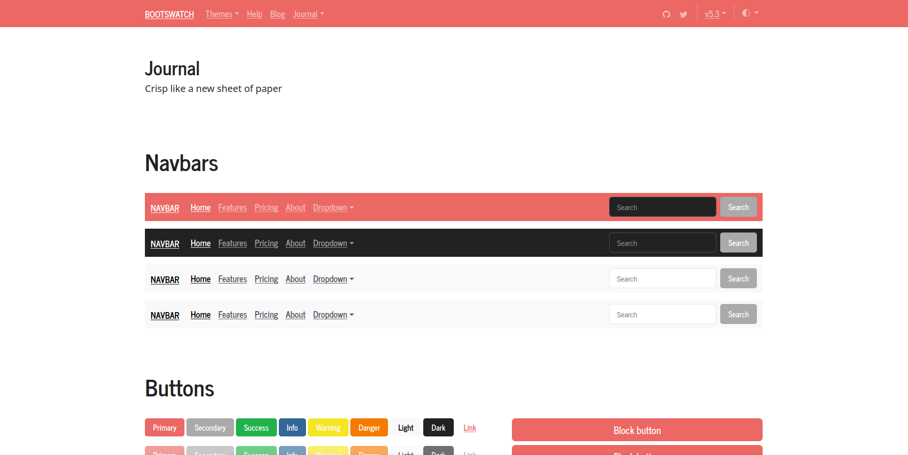
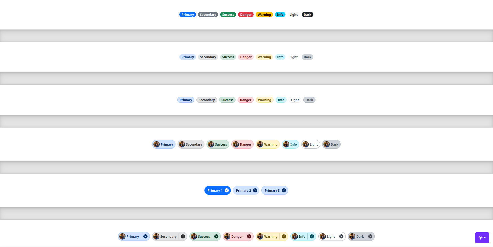

# nextjs-bootstrap-static-pages

NextJS Template configured for pure client-side application (AKA export mode), GitHub Pages deployment, and React-Bootstrap/Bootstrap 5.3 styling.

## 🚀 Use this template

### Via GitHub (recommended)

Press the "Use This Template" button and create your own repository.

### Via npx

Invoke `create-next-app`:

```
npx create-next-app@latest -e https://github.com/Shaumik-Ashraf/nextjs-bootstrap-static-pages
```

Setup a new GitHub repository (required for GitHub Pages):

```
git init
git add --all
git commit -m "init commit"
git remote add origin [new-repository-url]
git push --force -u origin main
```

## 📚 Dependencies

- [NodeJS](https://nodejs.org) v22.11.0 (may work with other versions)

## 💻 Developer Start

1. Open your command line and run `npm install`

2. Run `npm run dev` to start the development server

3. Open <http://localhost:3000> to view the live app

## ⚙️ Deployment

### GitHub Pages

1. Go to your repository **Settings -> Pages** and set **Source** to `GitHub Actions`.

2. Allow a few minutes to replicate, and the site will become available.

You can get more guidance at [GitHub's documentation](https://docs.github.com/en/pages).

### Generic Instructions

1. First, compile this app into static HTML, CSS, and JavaScript:

```
npm run build
```

The final output will be in the `out/` folder. The build process is powered by NextJS'
[export mode](https://nextjs.org/docs/pages/guides/static-exports).

2. Serve the contents in `out/` with a production-grade file server such as
[NGINX](https://nginx.org) or [Apache](https://apache.org/).

3. Acquire a domain, configure the DNS, and setup SSL certification. Consult your
hosting service or web server documentation for how do this.

This app also comes with an `npm start` command which will run a web server for you,
however it is recommended **not** to use this for production since it cannot handle
SSL, rate limiting, or other critical features.

## 📒 Documentation

- [NextJS 16](https://nextjs.org) **This app uses Pages mode**
- [React-Bootstrap](https://react-bootstrap.github.io/)
- [Bootstrap 5](https://getbootstrap.com/)
- [ReactJS 19](https://react.dev/)

### Themes

This template comes with bootstrap themes you can easily swap. The default theme is
[Brite](https://bootswatch.com/brite/) and you can select your theme by loading
its corresponding bootstrap CSS file in `styles/globals.css`. For example to use the
solar theme:

```
// styles/globals.css
@import "../themes/solar/bootstrap.min.css";
```

Themes are provided by [bootswatch](https://bootswatch.com/). Any theme should work.

You can also add [Sass support](https://nextjs.org/docs/app/guides/sass) to NextJS
and [customize bootstrap](https://getbootstrap.com/docs/5.3/customize/sass) directly.

#### Brite



#### Cerulean



#### Journal



#### Quarts


#### Vanilla

This is the default bootstrap theme.


